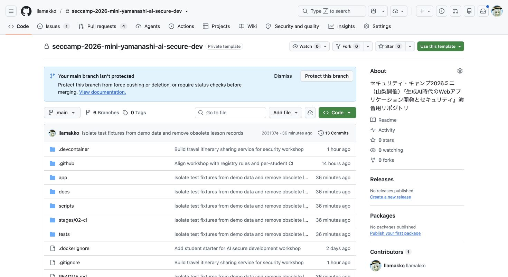
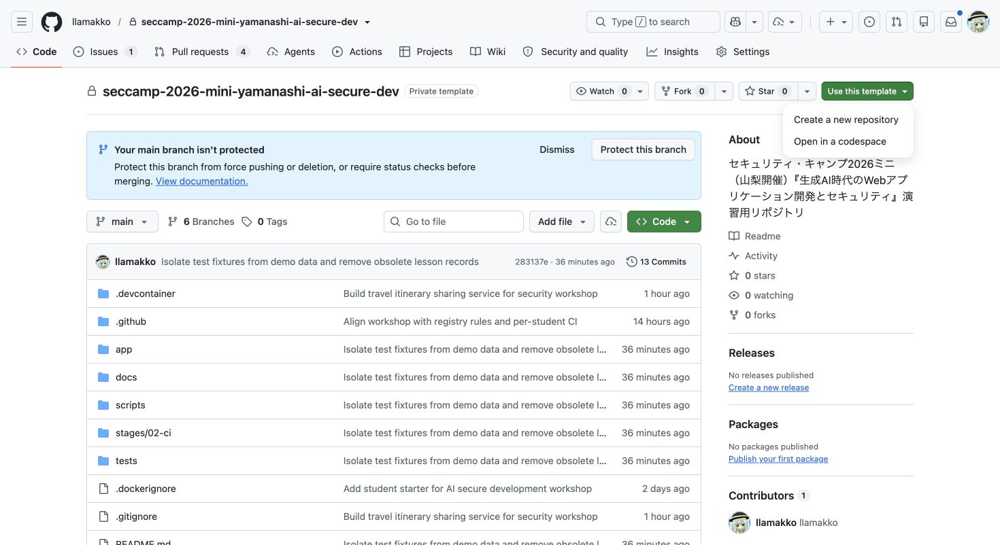
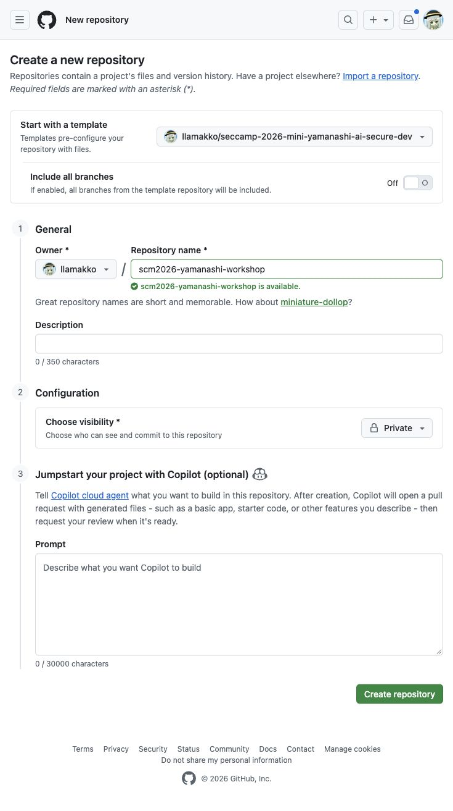
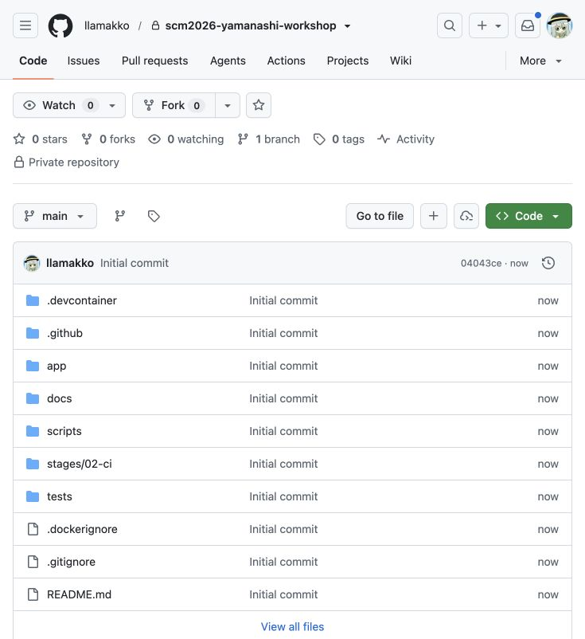
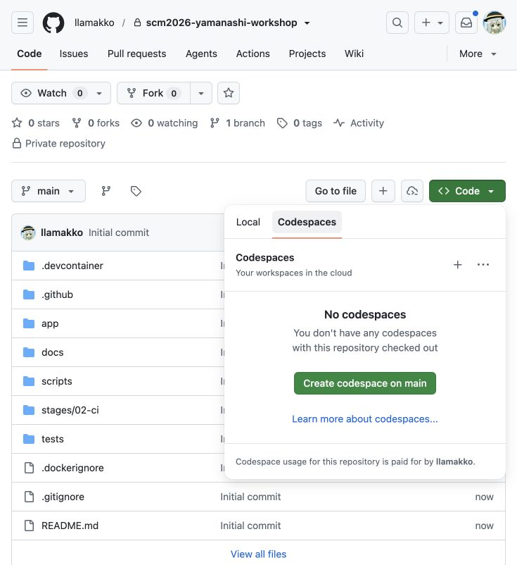
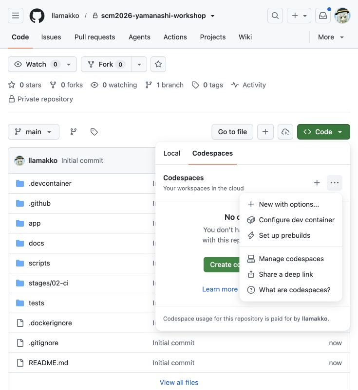
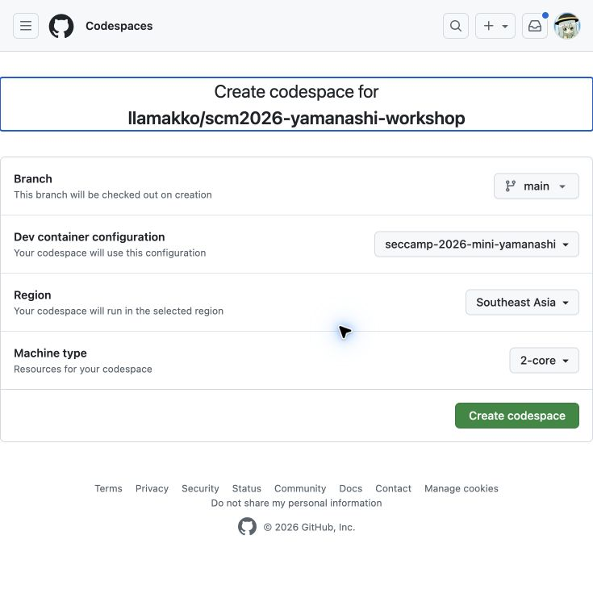
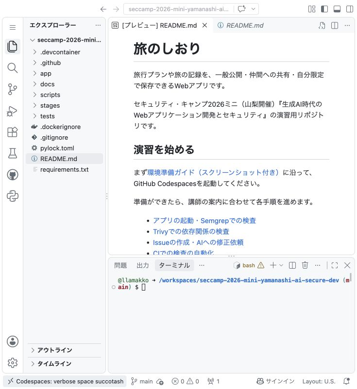

# 事前準備：GitHub Codespacesを起動する

講師の起動案内に合わせて、このページを上から順に進め、自分の教材リポジトリと開発環境を用意します。初回の環境構築には時間がかかるため、起動待ちの間は講義の説明を聞いてください。

GitHubに自分の個人アカウントでログインしてください。無料枠が不足している場合や支払い方法の登録を求められた場合は、設定を変更せず講師へ知らせてください。すでに作成済みなら、同じリポジトリ・Codespaceを再開します。

> 画像は講師アカウントで撮影した操作例です。自分の環境を作る手順では、GitHub IDや環境名を自分のものに読み替えてください。

## 1. 配布元の教材を開く

[配布元：llamakko/seccamp-2026-mini-yamanashi-ai-secure-dev](https://github.com/llamakko/seccamp-2026-mini-yamanashi-ai-secure-dev)を開きます。

配布元はPrivateです。講師からの招待を、自分が演習に使うGitHubアカウントで承諾してから開いてください。404になる場合は、ログイン中のアカウントと招待の承諾を確認し、開けなければ講師へ知らせてください。

## 2. Create a new repositoryを選ぶ

右上の**Use this template**を押し、**Create a new repository**を選びます。

今回は自分のリポジトリでIssue・PR・CIを使うため、ここでは`Open in a codespace`を選びません。

## 3. 作成フォームを入力する

次の内容で入力・選択し、最後に**Create repository**を押します。

| 項目 | 入力・選択する内容 |
|---|---|
| Repository template | `llamakko/seccamp-2026-mini-yamanashi-ai-secure-dev`のまま |
| Include all branches | **Off**のまま |
| Owner | **自分の個人アカウント**。組織アカウントは選ばない |
| Repository name | `scm2026-yamanashi-workshop`。使用済みなら末尾に`-2`などを付ける |
| Description | 空欄でよい |
| Choose visibility | **Private** |
| Jumpstart your project with Copilot / Prompt | 表示されても**空欄のまま**。ここではAIに生成を依頼しない |

PrivateでもCodespaces・Copilot Chat・GitHub Actionsを各サービスの無料枠内で利用できます。教材の架空データだけを使い、個人情報や秘密情報を書かないでください。

## 4. 自分のリポジトリができたことを確認する

作成が終わったら、画面上部が**自分のアカウント / 手順3で付けた名前**で、**Private**と表示されていることを確認します。`app`、`docs`、`scripts`、`README.md`があれば教材がコピーされています。

画像の所有者は講師のGitHub IDですが、自分のアカウントで作ったリポジトリで進めてください。ファイル一覧が空なら、先へ進まず講師へ知らせます。

## 5. CodeからCodespacesを開く

自分のリポジトリで緑色の**Code**を押し、**Codespaces**タブを選びます。

すでに自分の演習用Codespaceが表示されている場合は、その名前を押して再開し、手順8へ進みます。新しく何台も作る必要はありません。

## 6. New with optionsを選ぶ

Codespacesタブ右上の **三点メニュー（…）** から、**New with options...** を選びます。ブランチとマシン構成を確認する画面が開きます。

## 7. 今回の教材設定と2コアを確認して起動する

画面上部のリポジトリが自分のものであることを確認してから、次の設定で**Create codespace**を押します。

| 項目 | 選ぶ値 |
|---|---|
| Branch | `main` |
| Dev container configuration | **`seccamp-2026-mini-yamanashi`** |
| Region | 自動で選ばれた地域のままでよい |
| Machine type | **`2-core`** |

`公開メモ検索 演習`など違う設定名が出る場合は旧教材の可能性があります。起動せず、開いているリポジトリを講師と確認してください。

配布元ではなく、手順3で作った自分のリポジトリから起動します。

## 8. READMEとターミナルが表示されたら準備完了

環境の準備中は、講義の説明を聞きながら待ちます。次の表示を確認できたら、この手順はいったん終了です。

- 左側：`app`や`docs`などのファイル一覧
- 中央：`README.md`を開けるエディタ
- 下側：入力待ちの**TERMINAL / ターミナル**

ターミナルが見えなければ、画面左上のメニューから**Terminal / ターミナル → New Terminal / 新しいターミナル**を開きます。READMEは左側の一覧から選びます。

演習アプリの起動は第2章で、[アプリを動かす手順](01-start-and-scan.md)に沿って一緒に進めます。転送ポートも**Private**のまま使います。リポジトリと転送ポートの公開範囲は別の設定です。

エラー・無料枠不足・画面が進まない場合は、表示されている内容と手順番号を講師へ知らせてください。支払い設定の変更や、環境の繰り返し作成は不要です。
