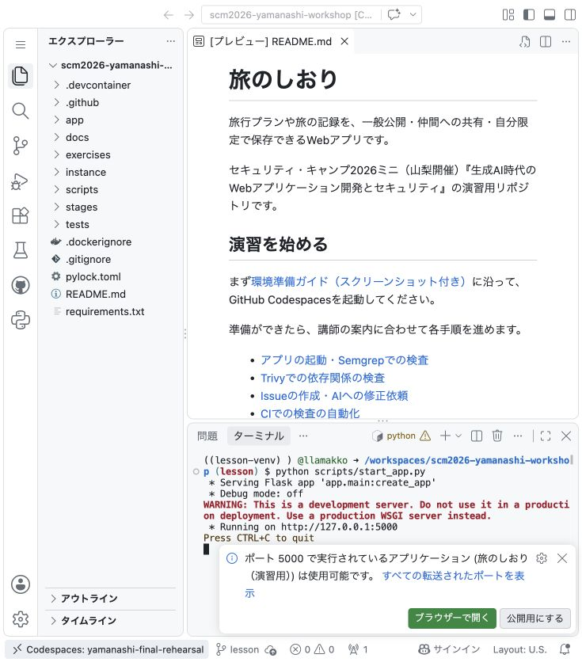
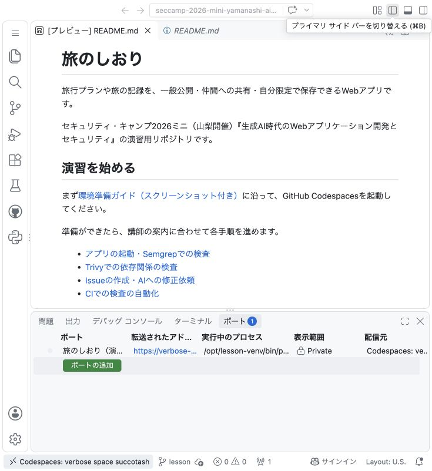
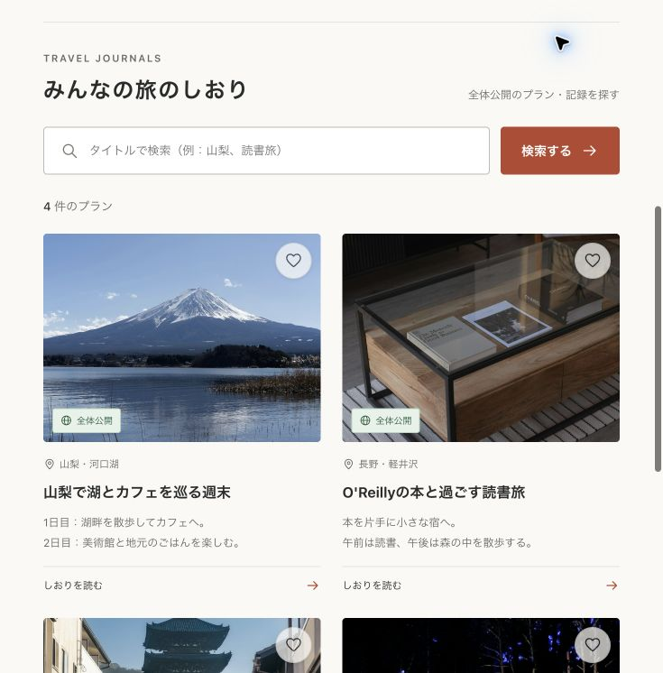
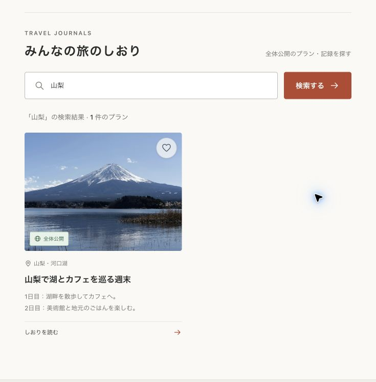
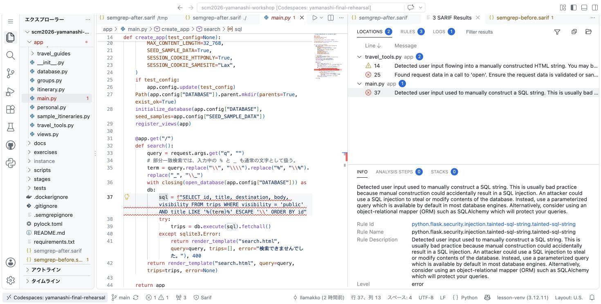
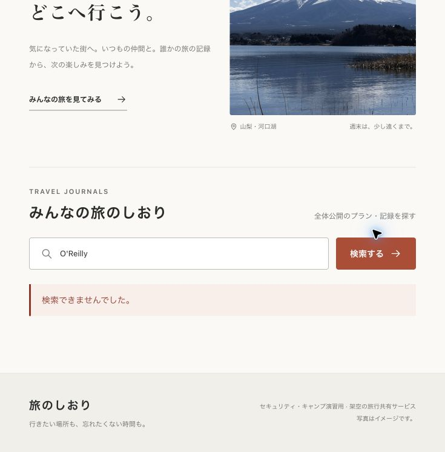
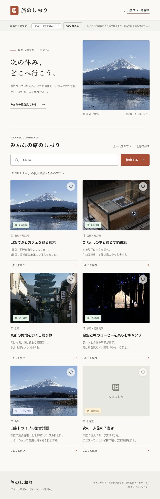

# 演習：アプリを動かし、Semgrepで検査する

アプリを動かし、Semgrepの指摘をコードと実際の動作で確かめます。修正は次の演習で行います。

まだCodespacesを起動していない場合は、[環境準備ガイド](00-codespaces-setup.md)を先に進めてください。起動済みなら同じ環境を使います。

**自分のリポジトリのCodespaces**で、下部のターミナルに入力します。ターミナルがなければ、左上のメニューから`Terminal → New Terminal`を選びます。

以降のコマンドは、`README.md`・`app/`・`scripts/`があるリポジトリのルートで実行してください。

この演習ではまだコードを変更しません。作業ブランチは、次の演習でCopilotに修正を依頼するときに作ります。

## 1. アプリを起動する

```sh
python scripts/start_app.py
```



`Running on http://127.0.0.1:5000`が表示されたら、次の操作で開きます。

1. 下部の`PORTS / ポート`で`5000`を探す。なければ`Add Port`で追加する。
2. 公開範囲が**Private**であることを確認する。
3. 5000番の行の地球アイコン（`Open in Browser`）を押す。



**完了の目印：** 「旅のしおり」と4件の公開プランが表示される。



このターミナルはアプリを動かしたまま残します。ブラウザには手元のPCの`localhost`を入力せず、ポート一覧から開いてください。

## 2. 普通の検索を試す

公開検索の対象は**全体公開のプランだけ**です。グループ限定・自分限定のプランは、検索結果に表示されない仕様です。

画面上部の利用者切替は、架空の利用者の視点を試すデモ機能です。本人認証を行うログイン機能ではありません。

アプリの検索欄で`山梨`を検索します。

**完了の目印：** 「山梨で湖とカフェを巡る週末」だけが表示される。



ここで講師の案内を待ちます。[Trivyの演習](05-trivy.md)を挟んでから、次のSemgrep検査へ進みます。

## 3. Semgrepで検査する

`Terminal → New Terminal`で**検査用のターミナルをもう一つ開き**、実行します。Semgrepはインストール済みです。`p/owasp-top-ten`はOWASP Top 10に関連する複数言語の既存ルールセットで、取得には通信が必要です。

```sh
semgrep scan --config p/owasp-top-ten --sarif-output semgrep-before.sarif app/
```

Python・JavaScript等が対象です。Jinjaテンプレートは解析警告が出るため、配布済みの`.semgrepignore`で`app/templates/`を除外しています。Python側のHTML生成は検査しますが、テンプレート自体の安全性はこの検査では確認していません。

結果は画面と`semgrep-before.sarif`の両方へ出力されます。SARIFは解析結果を保存・共有する共通形式です。この教材ではリポジトリ直下に保存し、`.gitignore`で除外してcommitしない運用にしています。

### SARIF Viewerで開く

1. 左のファイル一覧で`semgrep-before.sarif`をクリックする。
2. 開いた`SARIF Results`で、ファイル名の左の`〉`をクリックする。
3. 指摘文をクリックして下部の説明を読み、左の行番号をクリックして対象コードへ移動する。



端末で`code semgrep-before.sarif`を実行しても開けます。結果パネルが出ない場合はコマンドパレットで`SARIF: Show Panel`を検索してください。拡張機能`MS-SarifVSCode.sarif-viewer`が未導入なら追加します。GitHub Code Scanningへの接続は不要です。Viewerが使えなければ端末の指摘で続行できます。

**完了の目印：** 次の3種類の指摘が表示される。必須のSQLの指摘を選び、入力値がどこで使われているか確認する。

| 機能・ファイル | 指摘される問題 | 確認したいこと |
|---|---|---|
| 公開プラン検索・`app/main.py` | SQLインジェクション | 入力で検索条件を変えられないか |
| 印刷用の見出し・`app/travel_tools.py` | XSSにつながるHTML生成 | 入力をHTMLとして解釈していないか |
| 持ち物リストのダウンロード・`app/travel_tools.py` | パストラバーサル | 配布用フォルダの外を読めないか |

必須演習では公開プラン検索の1件を再現・修正し、CIに組み込みます。残り2件は[選択課題](08-extra-findings.md)です。教材の検証時は各1件でしたが、ルールの更新などで結果は変わる場合があります。

ルール取得失敗・解析エラー・検査対象0ファイルは、検出成功とは区別してください。

## 4. 指摘を動作で確かめる

**この教材アプリの検索欄だけで**、次を試します。SQL入力は末尾の空白も含めてコピーしてください。

| 検索語 | 本来の動作 | 初期版で起きること |
|---|---|---|
| `山梨` | 公開された該当プランだけ表示 | 期待どおりに動く |
| `O'Reilly` | 「O'Reillyの本と過ごす読書旅」を表示 | 「検索できませんでした」となる |
| `' OR 1=1 -- ` | 該当する公開プランがないので0件 | グループ限定・自分限定のプランまで表示される |

**完了の目印：** 正当な入力でも検索に失敗することと、公開範囲を超えた情報が表示されることを確認できた。





検索語と結果をメモし、[Issue作成・修正依頼](02-issue-and-review.md)へ進みます。

## 事前準備: Copilotを使うアカウント

後半の修正演習までに、CodespacesでCopilot Chatを開き、必要なら自分のGitHubアカウントでサインインしてください。APIキーやPersonal Access Tokenの入力は不要です。

「日本語で短く返答してください。まだファイルの変更やコマンド実行はしないでください」と送り、返答を確認します。Copilotの利用枠はCodespacesとは別です。利用できなければ講師に知らせ、[比較用修正案](04-fallback.md)を使います。

## 困ったとき

| 状況 | 対応 |
|---|---|
| 環境が起動しない・無料枠が足りない | 作り直しや課金設定の変更はせず、講師へ知らせる |
| `scripts/...`が見つからない | ターミナルの作業場所に`README.md`・`app/`・`scripts/`があるか確認する |
| FlaskやSemgrepが見つからない | `python scripts/check_environment.py`を実行し、出力を講師へ見せる。独自に最新版を入れない |
| 起動後にコマンドを入力できない | アプリが動作中なので正常。検査用のターミナルを追加する |
| 5000番が使用中 | 起動済みのアプリ用ターミナルを使い、二重起動しない |
| アプリを開けない | アプリが動いているか、PORTSに5000番があるか確認する。Publicには変更しない |
| Semgrepの指摘が出ない・実行に失敗する | 対象が`app/`、設定が`p/owasp-top-ten`か確認し、出力を講師へ見せる |
| Copilotが使えない | 講師へ知らせ、[代替手順](04-fallback.md)で進める |
